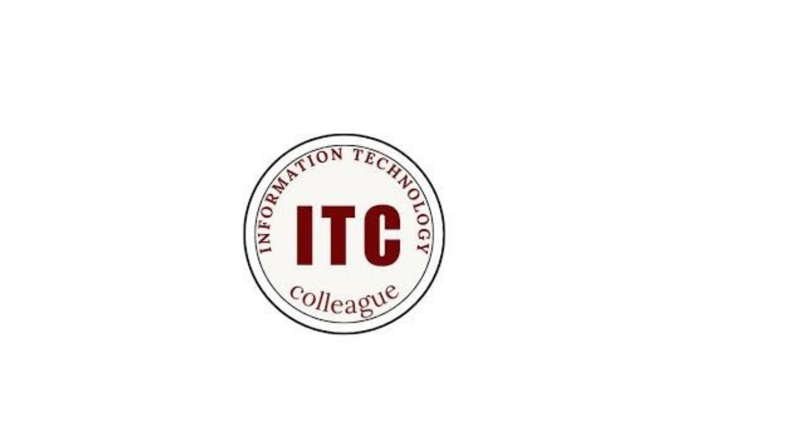

<div align="center">

<table>
  <tr>
    <td align="center" width="50%">
      <a href="[https://www.itc-colleague.com/](https://depi.gov.eg/)">
      
      </a>
    </td>
    <td align="center" width="50%">
         <a href="https://www.itc-colleague.com/">
      
      </a>
    </td>
  </tr>
</table>

<br>

# MaharaTech Automation Testing Project

### Final Automation Testing Project for the MaharaTech Platform

<p>
  
  
  
  
  
</p>

</div>

---

## 📌 Project Overview

This repository contains an automated testing framework for the **MaharaTech** learning platform.

The project is built using **Java, Selenium WebDriver, TestNG, Maven, Page Object Model (POM), and ExtentReports** to automate key user scenarios and generate a professional HTML execution report.

---

## 🎯 Main Objectives

* Automate core user journeys on the MaharaTech platform.
* Validate login, registration, and enrolment workflows.
* Apply a clean and maintainable **Page Object Model** structure.
* Generate professional execution reports using **ExtentReports**.
* Make test execution simple and organized through **Maven** and **TestNG**.

---

## 🧪 Covered Test Scenarios

| Module       | Covered Scenarios                                     |
| ------------ | ----------------------------------------------------- |
| Login        | Invalid credentials, empty fields, Google login flow  |
| Registration | Valid registration data, required-field validation    |
| Enrolment    | Logged-in user enrolment, guest redirect to login     |
| Reporting    | HTML execution report generation after test execution |

---

## 🛠️ Tech Stack

| Tool                   | Purpose                         |
| ---------------------- | ------------------------------- |
| **Java 17**            | Programming language            |
| **Selenium WebDriver** | Browser automation              |
| **TestNG**             | Test execution and assertions   |
| **Maven**              | Dependency management and build |
| **ExtentReports**      | HTML test reporting             |
| **Page Object Model**  | Maintainable test architecture  |

---

## 📂 Project Structure

```text
mahara-tech/
├── .idea/
├── src/
│   ├── main/java/
│   └── test/java/
│       ├── base/          # WebDriver setup and teardown
│       ├── DATA/          # Test data builders
│       ├── listeners/     # ExtentReports listener
│       ├── Pages/         # Page Object classes
│       └── tests/         # TestNG test classes
├── test-output/           # Generated reports after execution
├── DigitalEgypt.png       # Digital Egypt Pioneers Initiative logo
├── ITC.png                # ITC Colleague logo
├── MaharaTech_TestPlan_v2.pdf
├── MaharaTech_UserStories_AC (1).pdf
├── testing مشاريع .pdf
├── pom.xml                # Maven dependencies and plugins
├── testng.xml             # TestNG suite configuration
└── README.md
```

---

## 🚀 How to Run

### 1. Requirements

Before running the project, make sure you have:

* Java 17 or later
* Maven
* Google Chrome
* ChromeDriver matching your installed Chrome version
  or Selenium Manager support

---

### 2. Clone the Repository

```bash
git clone https://github.com/ZiadMahmoudas/mahara-tech.git
```

---

### 3. Open the Project Folder

```bash
cd mahara-tech/AutomationFinal/mahara-tech
```

---

### 4. Install Dependencies

```bash
mvn clean install
```

---

### 5. Run Tests

```bash
mvn clean test
```

You can also run the test suite directly from IntelliJ IDEA:

```text
Right click on testng.xml → Run
```

---

## 📊 Test Report

After running the test suite, the HTML report will be generated in:

```text
test-output/ExtentReport2.html
```

Open this file in your browser to review:

* Passed test cases
* Failed test cases
* Skipped test cases
* Execution details

---

## ⚙️ ChromeDriver Notes

If execution stops at:

```text
===== BEFORE CHROME DRIVER =====
```

Use the following fix:

1. Check your installed Chrome version from:

```text
chrome://settings/help
```

2. Download the matching **ChromeDriver** version for Windows x64.

3. Put the driver inside the project path:

```text
drivers/chromedriver.exe
```

4. Close all running `chrome.exe` and `chromedriver.exe` processes from Task Manager.

5. Run the tests again.

---

## ✅ Project Highlights

* Clean **Page Object Model (POM)** implementation.
* Organized and reusable page classes.
* TestNG assertions and test execution flow.
* Professional HTML reporting using **ExtentReports**.
* Maven-based project structure.
* Suitable for final project presentation and GitHub portfolio.

---

## 👥 Initiative & Collaboration

<div align="center">

<table>
  <tr>
    <td align="center" width="50%">
          <a href="[https://www.itc-colleague.com/](https://depi.gov.eg/)">
      
      </a>
      <br><br>
      <strong>Digital Egypt Pioneers Initiative</strong>
    </td>
    <td align="center" width="50%">
      <a href="https://www.itc-colleague.com/">
      
      </a>      <br><br>
      <strong>ITC Colleague</strong>
    </td>
  </tr>
</table>

</div>

---

## 📖 About This Project

This project represents a practical implementation of automation testing concepts learned during the training journey.

It demonstrates how to design, organize, execute, and report automated test scenarios in a professional and maintainable way.

---

<div align="center">

### 💙 Made with dedication for learning, practice, and final project delivery

**Prepared as part of the Digital Egypt Pioneers Initiative and ITC Colleague activities.**

### I loved working with my friend Yahya, who worked exclusively with me throughout the project and was a true partner in struggle. We will definitely collaborate on many more projects together.

</div>
